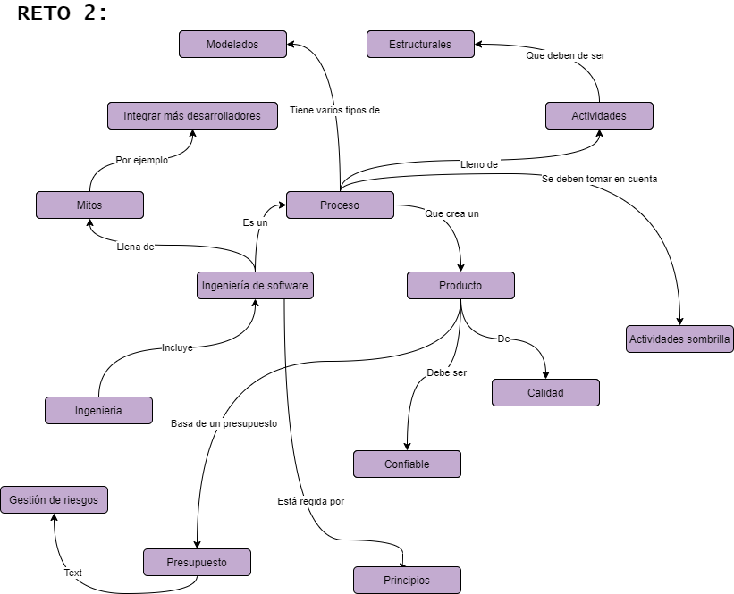

# Indicador de logro no. 1:

Analiza la importancia de la ingeniería de software y aplica modelos de desarrollo para producirlo de acuerdo con un contexto particular.

### Saber conceptual

* Diferencia con programación, definición, código de ética, perfil del ingeniero de software, visión de proceso y producto, modelos básicos de desarrollo.

* Modelos prescriptivos y modelos ágiles.

### Saber procedimental

* Diferenciación de los diferentes modelos prescriptivos y ágiles.

### Saber actitudinal

* Apropiación del código de ética, trabajo colaborativo, comunicación efectiva.
* Valoración de la importancia de la ingeniería de software como producto y como proceso.

# Artefacto:

## **Por qué se eligió el artefacto?**
Se eligió este archivo porque me ayudó a comprender de forma más general este bloque ya que era un ejercicio práctica, además de que resolvimos muchas dudas trabajando en equipo.

## **Que mejoraría?**
Trataría de razonar mejor mis respuestas para el RETO 3.

## **Red semántica:**

 

 

## **Cómo ayuda en mi misión de convertirme en ingeniero?**

Me brinda los conceptos necesarios para aplicar a lo largo de mi vida como ingeniero en informática.
